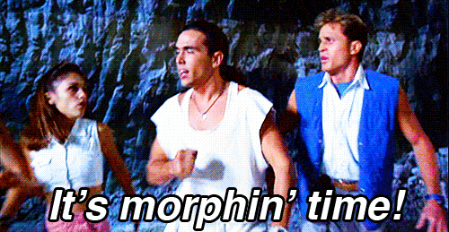

### Welcome to this FED@IBM workshop!

Today we’re going to work with the [hooks API](https://reactjs.org/docs/hooks-intro.html) released in [`React v16.8`](https://reactjs.org/blog/2019/02/06/react-v16.8.0). We’ll take a project built using the previous `React v16.7` release and leverage hooks to improve our code in terms of clarity, reusability and verbosity.

In our refactored codebase we’ll make use of the following hooks:

- [useState](https://reactjs.org/docs/hooks-reference.html#usestate)
- [useEffect](https://reactjs.org/docs/hooks-reference.html#useeffect)
- [useContext](https://reactjs.org/docs/hooks-reference.html#usecontext)
- [useReducer](https://reactjs.org/docs/hooks-reference.html#usereducer)
- [custom hooks](https://reactjs.org/docs/hooks-custom.html)

Although this isn’t the full range of hooks released in `v16.8`, hopefully you can take enough away from today to use in your existing and future projects built with React - and the rest you can explore for yourself!

From a UI perspective we’ll see no change in how our app looks "before hooks" and "after hooks". However our codebase and developer experience will certainly improve as a result. Perhaps not noticably on a project this size but at scale, with bigger products, larger development teams and quicker release cycles (as we experience at IBM) - the cleaner, clearer, and more reusable nature of hooks can have a real benefits day-to-day.

## Outline

Did you know there are now 13 FED@IBM Branches?! And they’re spread right across the globe - from California to India! I thought it would be cool to visualize that geographically in the application for this workshop.

INTRODUCING… the **FED@IBM Weather Center** 🌦

A simple app built using the Carbon Design System, for showing the weather info at each of our branches.

**Features include**:

- Displays the current weather info for each branch
- Displays today’s forecast for each branch
- Allows users to toggle temperature scale based on their preference (C°/F°)

[Open application](http://fed-at-ibm-weather-center.mybluemix.net/) 💻

### Code: As-is vs To-be

The as-is application built using `React v16.7` makes use of several popular React features (below). Although popular (and still very much relevant) within React, these concepts can at times be confusing to understand and verbose in terms of the amount of code needed to implement. Hooks will allow us to refactor these concepts to be clearer to read and easier understand.

| Feature                                                                  | `v16.7`: As-is                          | `v16.8`: To-be                                                         |
| ------------------------------------------------------------------------ | --------------------------------------- | ---------------------------------------------------------------------- |
| [State management](https://reactjs.org/docs/state-and-lifecycle)         | `this.state`, `this.setState()`         | [useState](https://reactjs.org/docs/hooks-reference.html#usestate)     |
| [Lifecycle methods](https://reactjs.org/docs/glossary#lifecycle-methods) | componentDidMount, componentDidUpdate   | [useEffect](https://reactjs.org/docs/hooks-reference.html#useeffect)   |
| [Context API consumption](https://reactjs.org/docs/context)              | `Component.contextType`, `this.context` | [useContext](https://reactjs.org/docs/hooks-reference.html#usecontext) |
| [Render prop components](https://reactjs.org/docs/render-props)          | See below                               | [Custom hook](https://reactjs.org/docs/hooks-custom.html)              |

```
// Render prop component
<GetUser>
{
 ({ user, loading }) => loading ? 'Loading user...' : `Hello ${user.name}!`
}
</GetUser>
```

## Fork and clone

This GitHub repository contains the code that we will be refactoring in today's workshop. At the root directory, you'll see 2 folders: `before-hooks` and `after-hooks`.

We will be working out of `before-hooks`, `after-hooks` is what our finished code should _roughly_ look like.
Feel free to use it as reference though!

### Fork

To begin, fork this repo to your GitHub account.

### Clone

Go to your forked repository, copy the SSH or HTTPS URL and in your terminal run the two commands to get the repository in your local file system and enter that directory.

```bash
$ git clone [your fork SSH/HTTPS]
$ cd fed-at-ibm-weather-center
```

### Add upstream remote

Add a remote called `upstream` so we can eventually submit a pull request once you have completed this tutorial step.

```bash
$ git remote add upstream git@github.com:ShayMurnin/fed-at-ibm-weather-center.git
```

Or, if you prefer to use HTTPS instead of SSH with your remotes:

```bash
$ git remote add https://github.com/ShayMurnin/fed-at-ibm-weather-center.git
```

Verify that your forked repository remotes are correct:

```bash
$ git remote -v
```

Your terminal should output something like this:

```bash
origin	[your forked repo] (fetch)
origin	[your forked repo] (push)
upstream	git@github.com:ShayMurnin/fed-at-ibm-weather-center.git (fetch)
upstream	git@github.com:ShayMurnin/fed-at-ibm-weather-center.git (push)
```

## Build and start

We've got the repository forked to your GitHub account, cloned down to your machine. Let's get the app up and running! Navigate into the `before-hooks` folder with:

```bash
$ cd before-hooks
```

Then install the React app's dependencies with:

```bash
$ yarn
```

After the dependencies are installed, you can start the app with:

```bash
$ yarn start
```


The app should (eventually) open up in your default browser window.

Now is a good time to take a look and familiarize yourself with the codebase. Take a look at the [React docs](https://reactjs.org/docs/getting-started) if there's anything that you're not familiar with or need a refresher. And feel free to ask questions.

**Let's get started!**

## Upgrade to React v16.8.0



To enter into the world of hooks, we must first update the versions of `react` and `react-dom` in `package.json` both to `16.8.0`:

```json
...
"react": "16.8.0",
"react-dom": "16.8.0",
...
```

Then run:

```bash
$ yarn && yarn start
```

And double check the app is still running!

## Refactor our Context.Provider

I think a good place to start for our refactor is our Context.Provider class in `context/TemperatureScaleContext.js`.

> This is a nice low hanging fruit, as we can change the implementation here - while not affecting the consuming components, as React allows us to mix and match implementations. Components are only concerned about themselves in terms of state, props, context etc. How they're being created up/down the tree has no effect on their consumption within other components. One of the benefits of React's backwards compatibility! This is definitely something to consider if you work on a React project that perhaps has a lot of "legacy" Class components that would benefit from refactoring to make use of hooks. Backwards compatibility allows your team to gradually make that switch.

We don't actually need to change are instantiation of our Context object. This is still how context is created.

```javascript
const TemperatureScaleContext = createContext();
```

We can however start by converting `TemperatureScaleProvider` from a Class component to a Function component.

```javascript
const TemperatureScaleProvider = ({ children }) => {
  ...
};
```

Next we can replace the `state` object that is used for instantiating state in Class components. Using the `useState` hook we can create our local Functional component state with the original default state of `'C'`, at the same time receiving it's mutation function that components consuming this state (as context) will call when updating the state anywhere within the app:

```javascript
const [scale, setScale] = useState("C");
```

The contents of the render method can be moved up into the main Functional component and references made to `this` can be removed as so:

```javascript
...
const value = {
  scale: scale,
  updateScale: setScale,
};

return (
  <TemperatureScaleContext.Provider value={value}>
    {children}
  </TemperatureScaleContext.Provider>
);
```

The app should be back to running normally and the toggle functionality should be working as it was previously.
